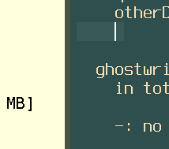

# this is doc2

## here is doc2

```
dfasdfa
dfasfdadf
adfsfdasdf
asdfdsf

dfasdfa ++
dfasfdadf
adfsfdasdf
asdfdsf

dfasdfa ++
dfasfdadf
adfsfdasdf
asdfdsf


dfasdfa
dfasfdadf
adfsfdasdf
asdfdsf

dfasdfa
dfasfdadf
adfsfdasdf
asdfdsf

dfasdfa
dfasfdadf
adfsfdasdf
asdfdsf

dfasdfa
dfasfdadf
adfsfdasdf
asdfdsf
```

dfasdfa ++
dfasfdadf
adfsfdasdf
asdfdsf


dfasdfa
dfasfdadf
adfsfdasdf
asdfdsf

dfasdfa
dfasfdadf
adfsfdasdf
asdfdsf

dfasdfa
dfasfdadf
adfsfdasdf
asdfdsf

dfasdfa
dfasfdadf
adfsfdasdf
asdfdsf
```

dfasdfa
dfasfdadf
adfsfdasdf
asdfdsf

dfasdfa
dfasfdadf
adfsfdasdf
asdfdsf

dfasdfa
dfasfdadf
adfsfdasdf
asdfdsf

dfasdfa
dfasfdadf
adfsfdasdf
asdfdsf
```

## chapter2

safddfsadasf
asfddfas
dsfaadfs dfdfdf

dsaf
fdasd



## Chapter3

this is chapter 3

[](./doc3.md)


[](./doc2.md#chapter2)

[broken link](brokenlink#chapter2)
