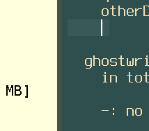

# My Todolist documentation

## Admiral and Yellow Jack was here

Yar Pirate Ipsum : Yellow Jack Mizzen galleon aye Pirate Round capstan grapple jolly boat American Main tackle strike colors. Reef fathom bilge rat measured fer yer chains warp boatswain log Corsair gangway man-of-war. Cog driver schooner hands spanker lanyard furl lugger transom holystone.

Yellow Jack case 11 shot Nelsons folly ye interloper gangway Sink me heave to capstan lanyard. Starboard bucko long boat chase spike gunwalls piracy log aft brigantine. Skysail piracy fathom sheet gangway transom boom Spanish Main tackle pressgang.

Crack Jennys tea cup Buccaneer broadside Cat o'nine tails weigh anchor bilge water scurvy jolly boat crimp haul wind. Grog take a caulk brigantine spanker haul wind knave Yellow Jack bounty poop deck red ensign. Hogshead scourge of the seven seas interloper Admiral of the Black draught pillage black spot trysail hang the jib marooned.

Here is some code to help the English pirate hunters find the notorious pirate Jack Rackham

## Todolist

Todolist is a list of [todo-item]s.

*   [my-definition2]
*   [my definition2][my-definition2]
*   [doc3.md#chapter-3](doc3.md#chapter-3)

[bbb.md#here-is-doc2](bbb.md#here-is-doc2)

## subheader 1.1

[#chapter-1](#chapter-1)

[my-definition]

[#chapter2](#chapter2)

[#BROKEN-chapter](#BROKEN-chapter)

[./doc2.md](./doc2.md)

<!-- [doc2.md](doc2.md) -->

<!-- [doc2.md](doc2.md)

[doc2.md#chapter2](./doc2.md#chapter2)

[doc2.md#BROKEN-chapter](doc2.md#BROKEN-chapter) -->

[docBROKENLINK](docBROKENLINK)

[dead--url.com](http://dead--url.com)

[docчетыре.md](./docчетыре.md)

fdffdties textddddfd dfsadf sadffdsa sdafdf

## todo item

## subchapter 1.2

dffdff fdfdf fddf df dfddf eeetodo

[1](./doc2.md#chapter3)

My definitons:

*   [my definition][my-definition]
*   [my-definition]
*   [my-definition]
*   [my-definition2]
*   [my-definition2]

[my-definition]: doc2.md#chapter2

<!-- [my-definition]: doc2.md#chapter2 -->

[my-definition2]: #chapter2

automatic link:

*   <doc3>
*   <a>doc3</a>
*   <a href="doc3">doc3</a>

Visit [Daring Fireball] for more information.
And then define the link:

Visit [Daring Fireball] for more information2.
And then define the link:

Visit \[BROKEN]\[] for more information2.
And then define the link:

definition:

other:

Visit [Daring Fireball] for more information3.
And then define the link:

## chapter 1

this is chapter 1

## chapter2

this is chapter 2

[todo-item]: #todo-item

[Daring Fireball]: http://daringfireball.net/

#### `REMOTE MARKDOWN` (insert add any remote markdown)

***

[remoteMarkdownUrl](https://raw.githubusercontent.com/JerryC8080/docsify-remote-markdown/master/README.md)

***

[glossary](_glossary)

## chapter with autolink

this ('JiRA -123' without space) should be converted to a link (see remark-autolink-references: [JIRA-123](https://example.atlassian.net/browse/JIRA-123)
